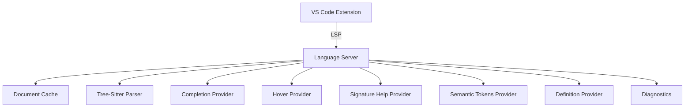
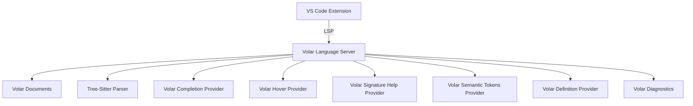

# План рефакторинга расширения Twig Language Server на Volar.js

## Цель

Переписать языковой сервер расширения VS Code для Twig, используя фреймворк `@volar/language-server` для упрощения реализации LSP и улучшения архитектуры.

## Текущее состояние

Расширение состоит из двух основных частей:

1. **Клиентская часть** (`src/client/extension.ts`) — расширение VS Code, использующее `vscode-languageclient` для подключения к языковому серверу.
2. **Серверная часть** (`src/server/`) — языковой сервер на основе `vscode-languageserver` с использованием `tree-sitter-twig` для парсинга.

### Функциональность сервера:

- Семантические токены (semantic tokens)
- Валидация синтаксиса (диагностика)
- Автодополнение (completion)
- Подсказки при наведении (hover)
- Помощь по сигнатурам (signature help)
- Определения (definitions)

## Предполагаемые преимущества Volar.js

- Готовые абстракции для создания языковых серверов
- Упрощённая работа с документами, позициями, AST
- Возможность использования встроенных утилит для TypeScript
- Лучшая интеграция с VS Code и поддержка современных возможностей LSP

## План рефакторинга

### 1. Анализ и подготовка

- [ ] Изучить документацию `@volar/language-server` (если доступна)
- [ ] Определить совместимость API с текущей реализацией
- [ ] Составить список необходимых изменений в зависимостях

### 2. Обновление зависимостей

- [ ] Добавить пакеты `@volar/language-server`, `@volar/typescript` (если требуется)
- [ ] Удалить `vscode-languageserver` и `vscode-languageserver-textdocument` (если они не нужны)
- [ ] Сохранить `tree-sitter-twig` и `web-tree-sitter` как парсер Twig
- [ ] Обновить `package.json` и `package-lock.json`

### 3. Рефакторинг серверной части

#### 3.1. Базовый класс сервера

- [ ] Создать новый класс сервера, наследуемый от `BaseLanguageServer` (или аналогичного в Volar)
- [ ] Переписать инициализацию сервера, регистрацию провайдеров
- [ ] Адаптировать обработку документов (вместо `TextDocuments` использовать `Documents` из Volar)

#### 3.2. Провайдер автодополнения (`CompletionProvider`)

- [ ] Переписать `CompletionProvider` с использованием API Volar
- [ ] Сохранить логику получения предложений на основе tree-sitter AST
- [ ] Интегрировать с кэшем документов

#### 3.3. Провайдер подсказок (`HoverProvider`)

- [ ] Адаптировать `HoverProvider` под Volar
- [ ] Сохранить логику определения типа элемента под курсором

#### 3.4. Провайдер помощи по сигнатурам (`SignatureHelpProvider`)

- [ ] Переписать с использованием `SignatureHelpProvider` Volar
- [ ] Сохранить текущую логику определения активной функции и её параметров

#### 3.5. Провайдер семантических токенов (`SemanticTokensProvider`)

- [ ] Переписать с использованием `SemanticTokensProvider` Volar
- [ ] Сохранить текущую легенду токенов и алгоритм разметки

#### 3.6. Провайдер определений (`DefinitionProvider`)

- [ ] Адаптировать `DefinitionProvider` под Volar
- [ ] Сохранить логику перехода к определению переменных, функций, шаблонов

#### 3.7. Диагностика (валидация)

- [ ] Переписать валидацию Twig с использованием AST tree-sitter
- [ ] Интегрировать с системой диагностики Volar

#### 3.8. Кэш документов (`DocumentCache`)

- [ ] Пересмотреть необходимость кэша в контексте Volar (возможно, Volar предоставляет собственный кэш)
- [ ] Адаптировать или заменить на `Documents` из Volar

### 4. Интеграция парсера

- [ ] Сохранить использование `tree-sitter-twig` для парсинга Twig
- [ ] Создать адаптер между AST tree-sitter и AST Volar (если требуется)
- [ ] Обеспечить эффективное обновление AST при изменениях документа

### 5. Клиентская часть

- [ ] Проверить совместимость клиента (`vscode-languageclient`) с Volar сервером
- [ ] При необходимости обновить конфигурацию клиента (например, изменить путь к серверу)
- [ ] Убедиться, что активация расширения и управление workspace folders работают корректно

### 6. Конфигурация и настройки

- [ ] Сохранить текущие настройки расширения (`modernTwig.phpBinConsoleCommand`)
- [ ] Адаптировать `ConfigurationManager` для работы с Volar API

### 7. Тестирование

- [ ] Провести модульное тестирование каждого провайдера
- [ ] Интеграционное тестирование с реальными файлами Twig
- [ ] Проверить все сценарии использования: автодополнение, ховеры, диагностика и т.д.
- [ ] Убедиться, что производительность не деградировала

### 8. Документация и рефакторинг кода

- [ ] Обновить `README.md` с указанием изменений
- [ ] Добавить комментарии к новому коду
- [ ] Удалить устаревший код и зависимости

## Оценка рисков

1. **Недостаточная документация Volar.js** — может потребоваться исследование исходного кода Volar.
2. **Несовместимость API** — возможны изменения в логике провайдеров.
3. **Потеря функциональности** — необходимо тщательное тестирование.
4. **Увеличение сложности** — если Volar окажется избыточным для простого сервера Twig.

## Альтернативы

- Оставить текущую реализацию, если рефакторинг не принесёт значительных преимуществ.
- Использовать только отдельные утилиты Volar, не переписывая весь сервер.

## Следующие шаги

1. Получить подтверждение плана от заинтересованных сторон.
2. Начать с этапа 1 (анализ и подготовка).
3. Поэтапно реализовывать изменения, проверяя работоспособность после каждого шага.

## Приложения

- Схема текущей архитектуры (см. ниже)
- Схема целевой архитектуры (см. ниже)

## Диаграммы

### Текущая архитектура

### Целевая архитектура с Volar.js

---

_План составлен: 2026-04-04_
_Автор: SourceCraft Code Assistant Agent_
